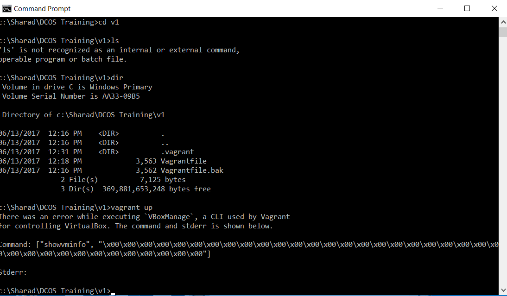

# Parking Lot

## Issues we face while executing the hands on tasks and the ways we resolve them.

* when downloading precise32/64 system asks if we need to use Virtual Box or VMware or sth else 
	we choose Virtual Box
* If you are using Win10 OS then make sure "Trusted Execution" checkbox is enabled under Virtulization Support in bios setting.

* while running vagrant up, the following error was seen.

	
  
  There was an error while executing `VBoxManage`, a CLI used by Vagrant
  for controlling VirtualBox. The command and stderr is shown below.

  `Command: ["showvminfo", "\x00\x00\x00\x00\x00\x00\x00\x00\x00\x00\x00\x00\x00\x00\x00\x00\x00\x00\x00\x00\x00\x00\x00\x00\x00\x00\x00\x00\x00\x00\x00\x00\x00\x00\x00\x00"]
  Stderr:...`

  Doing the following, resolved the issue on my machine
	* Disabled Hyper V in Contro Panel-->Program and Features -->Turn Windows Feature on or off
	* Made sure that Docker service was stopped under Processes in Task Manager.
	* Deleted .vagrant.d, .VirtualBox, virtual box created under VirtualBox VMs from c:/users/<user>* **when downloading precise32/64 system asks if we need to use Virtual Box or VMware or sth else**
	we choose Virtual Box

* **unix folder name contains a space**

* **is the VagrantFile required to be in ruby?**
	A VagrantFile needs to be ruby

* **are the first two lines of the VagrantFile mandatory?**
	```
	__# -*- mode: ruby -*-
	# vi: set ft=ruby :__
	```
	We've seen that these lines are at the top of all sample Vagrant files.
	These lines are not mandatory for the working of Vagrant itself (they are just comments, as far as Vagrant is concerned)
	These lines are called 'modelines' and inform a vi or emacs editor of the language and syntax being used in the file.

* when switching back from docker lab to DCOS on windows, disable HyperV again.
