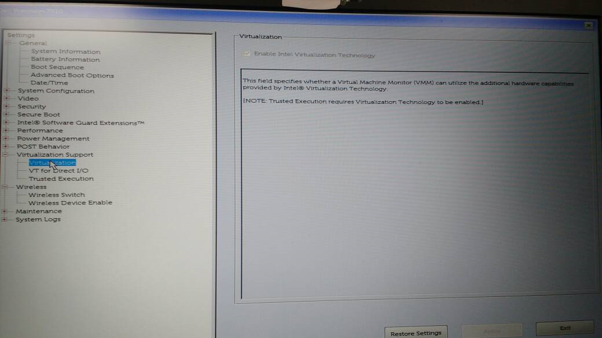
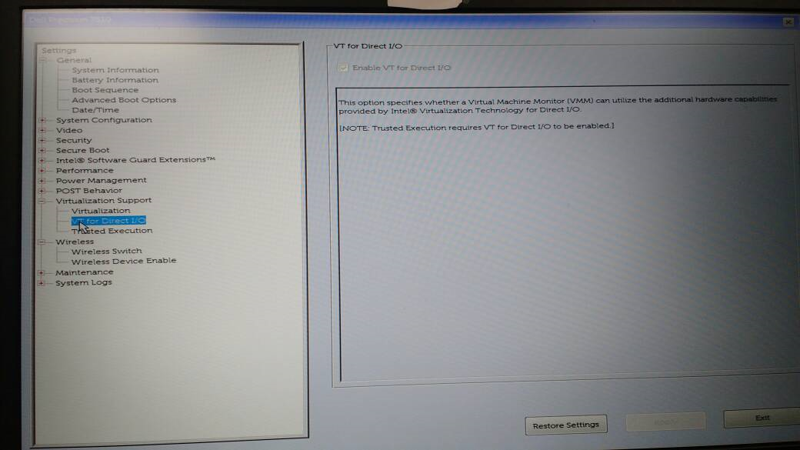

# Parking Lot

## Issues we face while executing the hands on tasks and the ways we resolve them.

* When downloading precise32/64 system asks if we need to use Virtual Box or VMware or sth else we choose Virtual Box

* If you are using Win10 OS then make sure "Trusted Execution" checkbox is enabled under Virtulization Support in bios setting.
	* Here are the bios settings from one of the machines:




* While running vagrant up, the following error was seen.


  
  There was an error while executing `VBoxManage`, a CLI used by Vagrant
  for controlling VirtualBox. The command and stderr is shown below.

  `Command: ["showvminfo", "\x00\x00\x00\x00\x00\x00\x00\x00\x00\x00\x00\x00\x00\x00\x00\x00\x00\x00\x00\x00\x00\x00\x00\x00\x00\x00\x00\x00\x00\x00\x00\x00\x00\x00\x00\x00"]
  Stderr:...`

  Doing the following, resolved the issue on my machine
	* Disabled `Hyper V` in Contro Panel-->Program and Features -->Turn Windows Feature on or off
	* Made sure that `Docker` service was stopped under Processes in Task Manager.
	* Deleted `.vagrant.d`, `.VirtualBox`, virtual box created under VirtualBox VMs from `c:/users/<user>`

* Unix folder name contains a space
	* Fix folder names so there are no spaces

* Is the VagrantFile required to be in ruby?
	* A VagrantFile needs to be ruby

* Are the first two lines of the VagrantFile mandatory?
	```
	__# -*- mode: ruby -*-
	# vi: set ft=ruby :__
	```
	We've seen that these lines are at the top of all sample Vagrant files.
	These lines are not mandatory for the working of Vagrant itself (they are just comments, as far as Vagrant is concerned)
	These lines are called 'modelines' and inform a vi or emacs editor of the language and syntax being used in the file.

* When switching back from docker lab to DCOS on windows, disable HyperV again.

* Error when starting DC/OS cluster:
```
Job for dcos-setup.service failed because the control process exited with error code. See "systemctl status dcos-setup.service" and "journalctl -xe" for details.
```

---

dcos auth login

use the link to fetch the token and login to the CLI

then use 

ssh -t vagrant@jskh 

---

* In windows 7, when using the git bash or mingw shell,
to fire a `dcos.exe` command such as `dcos auth login` prefix the command with `'winpty'`
so the command should look like:
`winpty dcos auth login`


---

Here's the command to view zookeeper logs (though it's not a part of the present session)

```journalctl -u dcos-exhibitor -b```

(ssh into the master before you fire this)

---

To see Mesos logs.
http://m1.dcos/mesos/#/

To see Marathon
http://m1.dcos/marathon/ui/#/apps


# Finding a Public Agent IP
**Prerequisites**

- DC/OS is installed with at least 1 master and public agent node
- DC/OS CLI 0.4.6 or later
- [jq](https://github.com/stedolan/jq/wiki/Installation)
- SSH configured

You can find your public agent IP by running this command from your terminal. This command SSHs to your cluster to obtain cluster information and then queries [ifconfig.co](https://ifconfig.co/) to determine your public IP address.

```
for id in $(dcos node --json | jq --raw-output '.[] | select(.attributes.public_ip == "true") | .id'); do dcos node ssh --option StrictHostKeyChecking=no --option LogLevel=quiet --master-proxy --mesos-id=$id "curl -s ifconfig.co" ; done 2>/dev/null
```

Here is an example where the public IP address is `52.39.29.79`:

```
for id in $(dcos node --json | jq --raw-output '.[] | select(.attributes.public_ip == "true") | .id'); do dcos node ssh --option StrictHostKeyChecking=no --option LogLevel=quiet --master-proxy --mesos-id=$id "curl -s ifconfig.co" ; done 2>/dev/null
52.39.29.79
```


